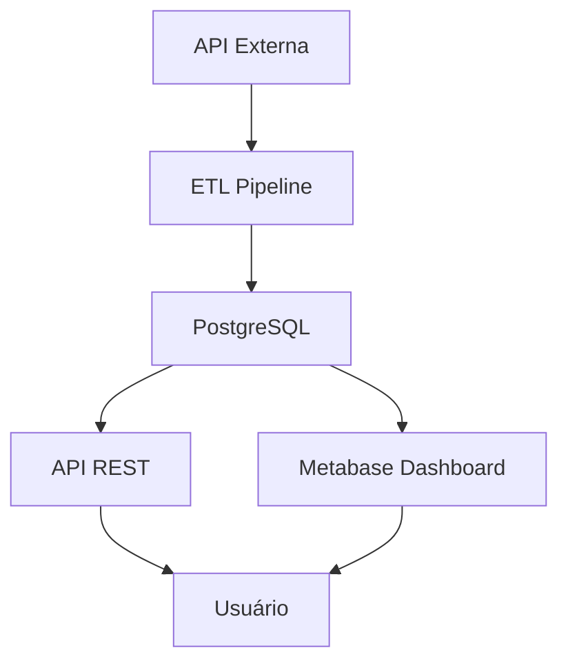
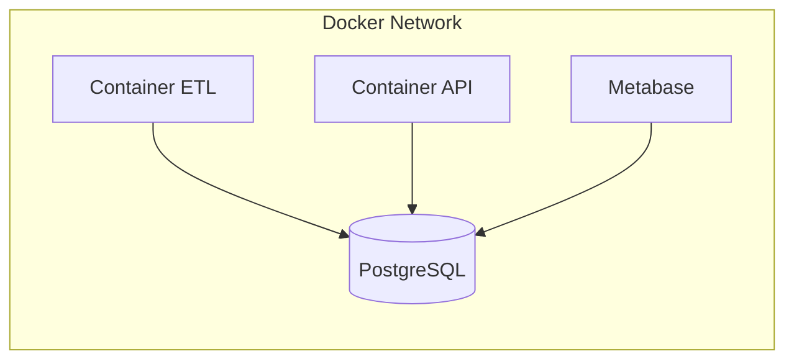
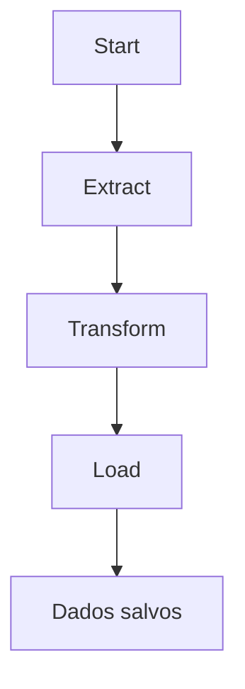
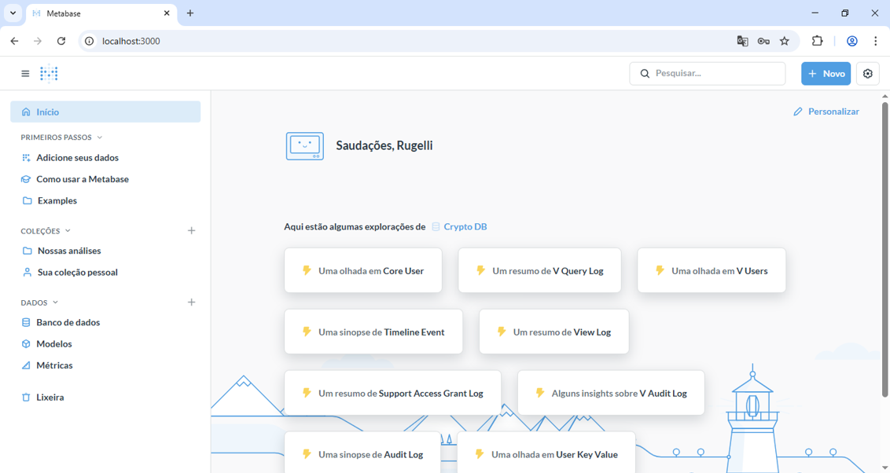
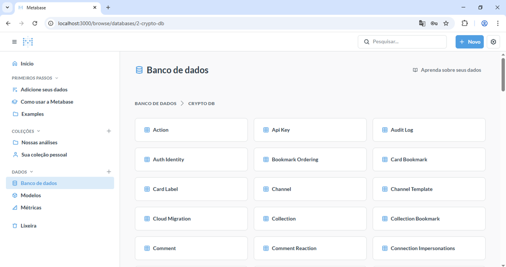
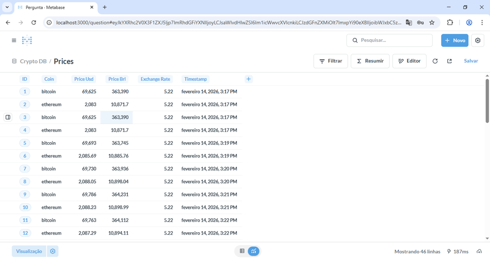
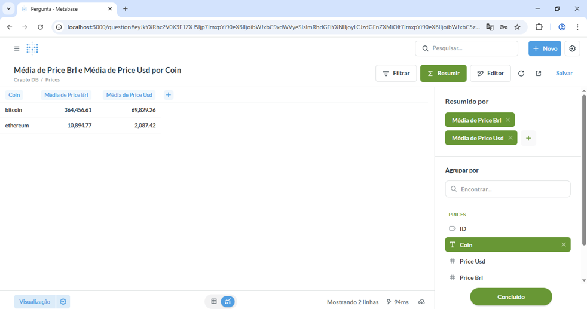

# 🚀 Crypto Data Pipeline

Projeto de engenharia de dados que implementa um pipeline ETL completo para coleta, transformação e disponibilização de preços de criptomoedas. O sistema utiliza containers Docker, banco de dados relacional, API REST e dashboard analítico.

---

## 🎯 Objetivo do Projeto

Demonstrar competências em engenharia de dados:

* Construção de pipelines ETL profissionais
* Containerização com Docker
* Desenvolvimento de APIs REST
* Modelagem e persistência de dados
* Boas práticas de desenvolvimento
* CI/CD

---

## 📌 Visão Geral

Este projeto demonstra a construção de um pipeline de dados profissional com:

* Extração de dados de API externa
* Transformação e enriquecimento dos dados
* Persistência em banco PostgreSQL
* Exposição via API REST
* Visualização com dashboard (Metabase)
* Orquestração com Docker
* Testes automatizados
* CI/CD com GitHub

Fluxo principal:



---

## 🏗️ Arquitetura do Sistema

Cada componente roda em um container isolado:



### Serviços

* **db** → banco PostgreSQL
* **etl** → pipeline de dados
* **api** → serviço REST
* **metabase** → visualização de dados

---

## ⚙️ Stack Tecnológica

* Python 3.11
* FastAPI
* SQLAlchemy
* PostgreSQL
* Docker & Docker Compose
* Pytest
* Metabase
* GitHub Actions (CI/CD)

---

## 🔄 Pipeline ETL

O pipeline segue o padrão **Extract → Transform → Load**.

### 1. Extract

Coleta preços de criptomoedas em USD e BRL a partir de API externa.

### 2. Transform

* Padroniza a estrutura dos dados
* Adiciona timestamp UTC
* Calcula taxa de câmbio implícita

### 3. Load

* Cria tabela automaticamente (se não existir)
* Insere histórico incremental no banco

Fluxo ETL:



---

## 📂 Estrutura do Projeto

```
crypto-data-pipeline/
│
├── api/                # API REST
├── etl/                # Pipeline ETL
├── tests/              # Testes automatizados
├── docker-compose.yml
├── requirements.txt
└── README.md
```

### Descrição das pastas

* **api/** → endpoints REST e lógica da API
* **etl/** → scripts de extração, transformação e carga
* **tests/** → testes automatizados do pipeline

---

## ▶️ Como Executar o Projeto

### Pré-requisitos

* Docker
* Docker Compose

### Passos

```bash
git clone https://github.com/seu-usuario/crypto-data-pipeline.git
cd crypto-data-pipeline
docker-compose up --build
```

### Serviços disponíveis

* API: http://localhost:8000
* Metabase: http://localhost:3000
* PostgreSQL: porta 5432

---

## 🔌 Endpoints da API

### Listar preços

```
GET /prices
```

Retorna todos os registros armazenados.

### Comparar moeda

```
GET /compare/{coin}
```

Compara valores USD x BRL de uma moeda específica.

---

## 🧪 Testes

Executar testes automatizados:

```bash
pytest
```

Os testes validam a etapa de extração do pipeline ETL.

---

## 🐳 Docker

O projeto utiliza Docker Compose para orquestrar:

* Banco de dados PostgreSQL
* Pipeline ETL
* API REST
* Dashboard Metabase

Todos os containers compartilham uma rede interna isolada.

---

## 🔁 CI/CD

Fluxo de desenvolvimento:

```
develop → pull request → testes automáticos → merge main
```

Esse fluxo garante qualidade de código e integração contínua.

---

## 📊 Visualização de Dados

O Metabase conecta diretamente ao PostgreSQL para visualização dos dados históricos.

Exemplos de análises possíveis:

* Evolução de preços das criptomoedas
* Comparação entre moedas
* Taxa de câmbio implícita

<p align="center">
  
  
</p>

<p align="center">
  
  
</p>

---

## 📜 Licença

Projeto desenvolvido para fins educacionais e de portfólio.